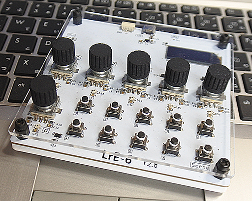

# LrE-6
Adobe Lightroom MIDI Developper Controller project (STM32F072 based)
LrE-6 MIDI controller is formed by embedded hardware board and its firmware.
It Used with [MIDI2LR](https://github.com/rsjaffe/MIDI2LR) software,
You can control development parameters on RAW photos.    
Information related Build,Configure & Use exist on wiki(currently link to [LrLite](https://github.com/jenoki/LrLite/wiki)
***
Lightroom is Registerd Trademark of Adobe Corp.